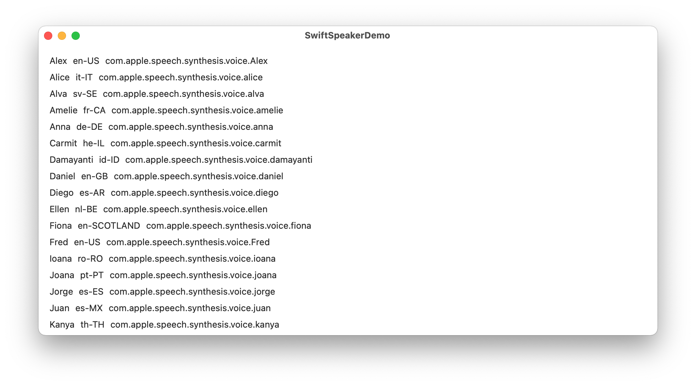
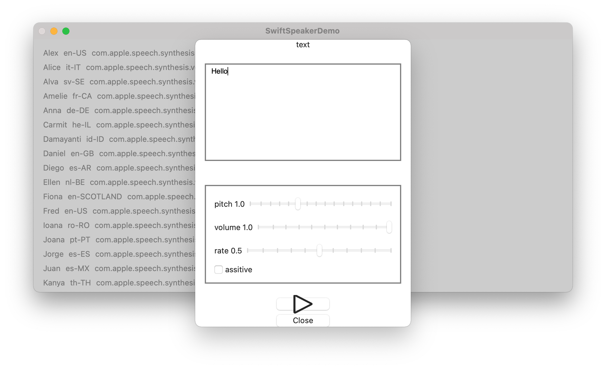

# SwiftSpeakerDemo

Project for checking and demonstrating [AVSpeechSynthesizer](https://developer.apple.com/documentation/avfaudio/avspeechsynthesizer).

[AVSpeechSynthesizer](https://developer.apple.com/documentation/avfaudio/avspeechsynthesizer)の動作確認とデモ用プロジェクト.

# Environment

- macOS 11.6
- Xcode 13.0

# Views

## ContentView

ContentView displays the list of [AVSpeechSynthesisVoice](https://developer.apple.com/documentation/avfaudio/avspeechsynthesisvoice) in the execution environment.

実行環境の[AVSpeechSynthesisVoice](https://developer.apple.com/documentation/avfaudio/avspeechsynthesisvoice)の一覧を表示します。

## SpeakerView

SpeakerView is a screen for testing speech to the Voice specified in ContentView.

ContentViewで指定したVoiceに対して発話を確認する画面です。

